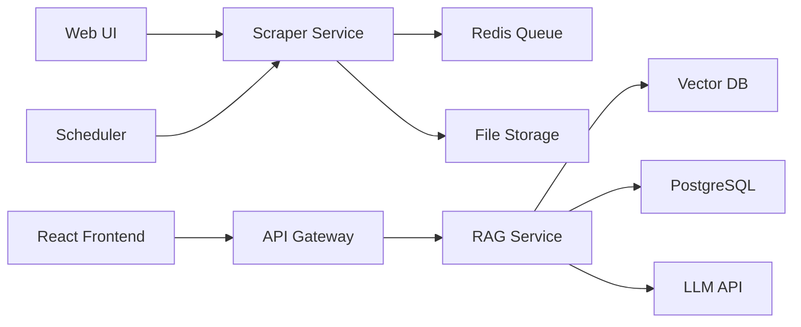

# BD Law Assistant - Architecture Documentation

## 🏗️ Refactored Architecture (Completed)

The project has been successfully refactored into a clean microservices-ready architecture while maintaining backward compatibility.

## 📁 New Project Structure

```
BD Law Assistant/
│
├── services/                    # Microservices
│   ├── scraper/                # Data scraping service (Phase 1 - ✅ Complete)
│   │   ├── scrapers/           # Core scraping modules
│   │   │   ├── config/         # Configuration management
│   │   │   ├── core/           # Core components (Firecrawl, Queue, etc.)
│   │   │   ├── storage/        # Storage handlers
│   │   │   ├── utils/          # Utilities and logging
│   │   │   ├── validators/     # Content validators
│   │   │   ├── bd_law_crawler.py    # Main crawler
│   │   │   └── scheduler.py    # Scheduled tasks
│   │   ├── templates/          # Web UI templates
│   │   ├── web_crawler_app.py  # Flask web interface
│   │   └── requirements.txt    # Python dependencies
│   │
│   ├── rag/                    # RAG service (Phase 2 - 🚧 Next)
│   ├── gateway/                # API Gateway (Phase 3 - 📋 Planned)
│   └── frontend/               # React frontend (Phase 4 - 📋 Planned)
│
├── shared/                     # Shared components
│   ├── models/                # Shared data models
│   └── utils/                 # Common utilities
│
├── infrastructure/            # Infrastructure configuration
│   ├── docker/               # Docker configurations
│   │   └── Dockerfile.scraper
│   └── k8s/                 # Kubernetes manifests (future)
│
├── data/                     # Data storage
│   ├── raw/                 # Scraped raw data
│   │   ├── acts/           # English acts
│   │   ├── volumes/        # Legal volumes
│   │   └── bengali/        # Bengali content
│   ├── processed/          # Processed data
│   └── logs/              # Application logs
│
├── docs/                    # Documentation
│   └── archive/            # Archived/old documentation
│
├── docker-compose.yml      # Multi-service orchestration
├── start_services.sh       # Service startup script
└── .env                   # Environment variables
```

## 🔧 Services Overview

### 1. Scraper Service (✅ Operational)
- **Status**: Fully functional and tested
- **Components**:
  - Firecrawl integration for web scraping
  - Redis queue management
  - File storage with compression
  - Web UI for manual crawling
  - Scheduler for automated crawling

### 2. RAG Service (🚧 Next Phase)
- **Planned Components**:
  - FastAPI REST API
  - LangChain integration
  - Vector embeddings (FAISS/Pinecone)
  - OpenAI/Claude integration

### 3. API Gateway (📋 Planned)
- **Planned Components**:
  - Spring Boot gateway
  - JWT authentication
  - Request routing
  - Rate limiting

### 4. Frontend (📋 Planned)
- **Planned Components**:
  - React SPA
  - TypeScript
  - Tailwind CSS
  - Chat interface

## 🚀 Running the Services

### Using Docker (Recommended)
```bash
# Start all services
docker-compose up -d

# Start specific services
docker-compose up -d redis postgres
docker-compose up -d scraper web-ui

# View logs
docker-compose logs -f scraper
```

### Local Development
```bash
# Start Redis (required)
redis-server --port 6379

# Run scraper
cd services/scraper
python scrapers/bd_law_crawler.py --test

# Run web UI
python web_crawler_app.py
```

### Using the Startup Script
```bash
# Docker mode
./start_services.sh docker

# Local development mode
./start_services.sh local
```

## 📊 Current Status

### ✅ Completed (Refactoring)
- Created clean service-based architecture
- Moved scraper to `services/scraper`
- Consolidated documentation
- Fixed import paths
- Updated Docker configurations
- Created missing scheduler.py
- Tested all existing functionality

### 🎯 Next Steps (Phase 2 - RAG Implementation)
1. Set up PostgreSQL schema for structured data
2. Implement FAISS vector database
3. Create FastAPI RAG service
4. Generate embeddings from scraped content
5. Implement query/response pipeline

## 🔌 Service Communication



## 📝 Environment Variables

Required environment variables (see `.env.example`):
```env
FIRECRAWL_API_KEY=your_api_key
REDIS_HOST=localhost
REDIS_PORT=6379
DB_HOST=localhost
DB_PORT=5432
DB_NAME=bdlaw
DB_USER=bdlaw
DB_PASSWORD=bdlaw123
```

## 🧪 Testing

### Test Scraper Service
```bash
# Test imports
cd services/scraper
python -c "from scrapers.bd_law_crawler import BDLawCrawler"

# Run test crawl
python scrapers/bd_law_crawler.py --test
```

### Test Web UI
```bash
# Ensure Redis is running first
redis-server --port 6379

# Start web UI
cd services/scraper
python web_crawler_app.py
# Access at http://localhost:5000
```

## 🛠️ Maintenance

### Clean up old data
```bash
rm -rf data/raw/acts/*.gz
rm -rf data/logs/*.log
```

### Reset Redis queue
```bash
redis-cli -p 6379
FLUSHALL
```

### View Docker logs
```bash
docker-compose logs -f --tail=100
```

## 📚 Resources

- [Firecrawl API Documentation](https://docs.firecrawl.dev/)
- [BD Laws Website](http://bdlaws.minlaw.gov.bd/)
- [Project MVP Plan](docs/mvp_implementation_plan.md)
- [System Design](docs/system_design_document.md)